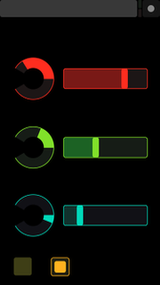
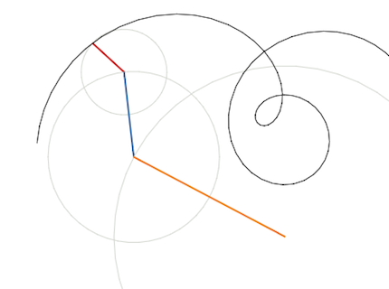

# Phoenix.OSC [](https://travis-ci.org/zampino/phoenix_osc)

_broadcasts OSC messages to Phoenix Channels from UDP streams_

## Short Story Long

After reading Mr. Armstrong's post [A Badass Way to Connect Programs Together](http://joearms.github.io/2016/01/28/A-Badass-Way-To-Connect-Programs-Together.html),
I thought it would be nice to use
[Open Sound Control](http://archive.cnmat.berkeley.edu/OpenSoundControl/OSC-spec.html) sensors and devices to control a Phoenix application.

May I quote?

> OSC should be renamed OAC – Open Anything Control

Not surprisingly, I found a myriad Elixir OSC parsers and decoders around. I've picked up
@jwarwick's [ex_osc](https://github.com/jwarwick/ex_osc) because it works well with [TouchOSC](http://hexler.net/software/touchosc).

## Usage

Take your Phoenix application,
add `phoenix_osc` to your list of dependencies in `mix.exs`:

```elixir
def deps do
  [
    {:phoenix, ...
    {:phoenix_osc, "~> 0.1.0", github: "zampino/phoenix_osc"},
    ...
  ]
end
```

Add `Phoenix.OSC` module as handler into your Phoenix endpoint configuration (e.g `config/config.exs`),
and optionally specify an UDP port to be listened to:

```elixir
config :my_app, MyApp.Endpoint,
  handler: Phoenix.OSC,
  osc_udp_port: 8001, # defaults to 8000
  pubsub: [name: Livex.PubSub,
           adapter: Phoenix.PubSub.PG2],
  ...

```

and that's it.

## Broadcast Topics and Events

Configure your device to emit OSC messages with an _address_ of the form `/topic:subtopic/event`.


## Some Example

[Elm graphic signals](//github.com/zampino/livex) controlled with TouchOSC:




## TODOS

- [ ] device feedback
